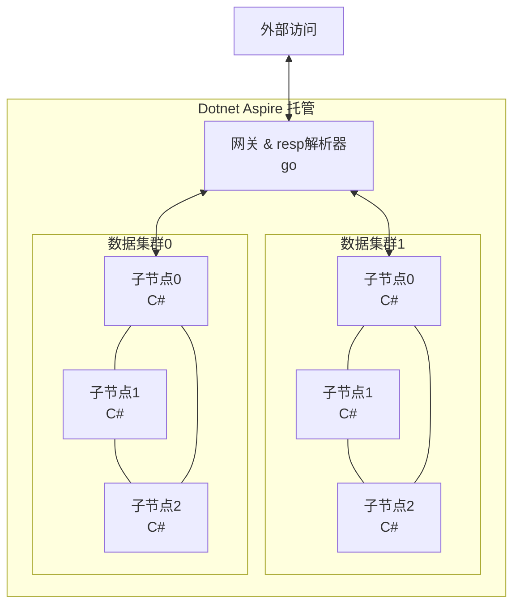

```mermaid
flowchart TB
    1[外部访问]<-->2
    subgraph Dotnet Aspire 托管
    2[网关 & resp解析器
    go]
    2<-->3
    2<-->6
        subgraph 数据集群0
        3[子节点0
        C#]
        4[子节点1
        C#]
        5[子节点2
        C#]
        3---4---5---3
        end
        subgraph 数据集群1
        6[子节点0
        C#]
        7[子节点1
        C#]
        8[子节点2
        C#]
        6---7---8---6
        end
    end
```